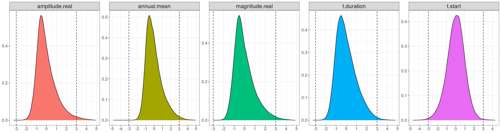

# MAREA satellite layers

This satellite product shows the per-pixel spring bloom metrics for a given year, as well as the annual average chl-a concentration. NetCDFs contain the map of values (1998-2024) for each of:  

- **t_start** (Spring bloom timing, day of year)  
- **t_duration** (Spring bloom duration, number of days)  
- **amplitude_real** (Maximum chl-a value during the spring bloom period, mg/m3)  
- **magnitude_real** (Total chl-a produced during the spring bloom period, days*mg/m3)  
- **annual_mean** (Average annual chl-a, mg/m3)   
- **NRMSE_bloom** (Gaussian fit RMSE within the bloom period, normalized to amplitude_real, used as a measure of bloom fit quality - i.e. accuracy of t.start and t.end)  
- **percent_dineof** (% of days with DINEOF-estimated values, used as a measure of data quality)  

## PRODUCT QC AND FITTING

### 1. INPUT DATA

- Product: Daily 4km-resolution OC-CCI POLY4 chl-a  
- Gaps filled using daily data input to DINEOF (3 years of data used as input to fill a single target year, i.e. target +- 1 year, except for 2 years in the case of the most recent year since the current year is incomplete)  

### 2. SMOOTH/FILTER DATA

For each bin and year, replace bin value with summary value based on the PhytoFit method of summarizing data inside a polygon (in this case, the polygon is the 20km radius around the bin):  

1. log the data   
2. filter outliers (mean+-3sd) within the 20km radius  
3. recompute the mean  
4. check if there's sufficient coverage (>20%) - if not, set to NA  
5. convert back to linear space  

This "sliding window" method of QCing bin values helps smooth the data and remove extreme problematic values, especially around the coast. A similar method is used when collecting satellite / in situ matchups for validation. Note that these values are used in the computation of both the gaussian fits (and resulting bloom metrics) as well as the annual mean. See figure below for an example of the impact of smoothing on the bloom metric result (top: unsmoothed, bottom: smoothed).    

 
	
### 3. RESTRICT TO AREA OF INTEREST

Below are the vertices of the bounding polygon. This excludes Hudson Bay, Northwest Passages, and Baffin Bay, where the results become less reliable.  

			latitude = c(39,46,60,63,65,66,66,39,39)  
			longitude = c(-76,-76,-65,-65,-64,-62.5,-42,-42,-76)  

### 4. FIT A GAUSSIAN TO EACH BIN/PIXEL AND EACH YEAR

Restrict sigma (nonlinear least squares fitting parameter) to >=1, which equates to ~4 days (i.e. a bloom must be >= 4 days long).  
*Setting this limit forces the gaussian fitting procedure to find a better fit, instead of simply throwing these pixels out later - see fit quality indicator section below for more details.*  

We force the peak of the "bloom" to sometime between DOY 60 and 180, i.e. Mar1 - Jun29. Many bins/pixels have multiple blooms throughout the year, sometimes just within the potential "spring" bloom period, so this can be a bit arbitrary.   

### 5. FILTER BAD BIN/YEAR FITS

Valid POLY4 DINEOF-filled chl-a ranges from 0 to 100 mg/m^3, so this is a reasonable cutoff for the following variables:  

			df <- df %>%
			    dplyr::filter(between(`Amplitude[fit]`,0,100) &
			                      between(`Amplitude[real]`,0,100) &
			                      between(RMSE,0,100) &
			                      between(RMSE_bloom,0,100))

Note that *annual.mean* value of the bin is kept, only the gaussian bloom metrics are removed if outside this range.  

Experimenting with fit quality indicators

 

"Fit quality" is defined as the accuracy of the start/end of the bloom. Potential indicators:  

- **RMSE**: root mean square error measured over the entire potential fit period (i.e. DOY 1 to 220)  
- **RMSE_bloom**: root mean square error measured only within the bloom period (i.e. t[start] to t[end])  
- **NRMSE_bloom**: RMSE_bloom normalized to Amplitude[real] (i.e. maximum chl-a within the bloom period)  
- **AmpFoverR**: Amplitude[fit]/Amplitude[real]  
- **MagFoverR**: Magnitude[fit]/Magnitude[real]  
- **sigma**: parameter that controls the width of the gaussian curve  
- **sigmaoverAmpF**: sigma/Amplitude[fit]  
- **percent_dineof**: for a given bin/pixel and year, the percentage of pixels over the time series that were estimated by DINEOF  

For each of these potential indicators, a random selection of time series / gaussians were plotted to see if the fit quality noticeably declined in a linear fashion as the indicator increased/decreased.  
No patterns were observed for most of these potential indicators, but extremely low values of sigma (i.e. <4, which fits a bloom approximately 14-16 days long) generated bad bloom fits. To force the gaussian fitting procedure to try alternative fits in extreme low sigma cases, the fits were rerun with sigma forced to >=1 (i.e. a bloom approximately 4 days long).  
Fits with sigma <4 were retained, but it was noted that fits with NRMSE_bloom >1 did not capture the bloom timing accurately and were exclusively cases with sigma <4. These cases only accounted for 0.005% of fits over the entire time series, so they were filtered out. See example below of fits with increasing NRMSE_bloom, where plots with NRMSE_bloom >1 do not capture the bloom period.  

 
NRMSE_bloom and percent_dineof are included in the output for each year of data for further optional filtering. Fits with NRMSE_bloom > 0.5 could also be suspect, but the exact threshold is left up to the user. Per-pixel climatologies and annual standardized anomalies can be calculated for the full time series of values for each bloom metric, and anomalies >3 standard deviations from the mean could be removed (see below for the distribution of metric anomalies over the time series). Alternatively when calculating the statistics of an area, pixels could be weighted according to NRMSE_bloom or their standarized anomalies, with extreme outliers contributing less to the result than others.  

 

## OUTPUT FILES

Layers are mapped using an equidistant cylindrical projection and written to netCDFs (one netCDF for each year). Each netCDF contains the layers for t_start, t_duration, amplitude_real, magnitude_real, and annual_mean, as well as NRMSE_bloom and percent_dineof.  

Per-pixel climatologies can be calculated from these layers over a user-selected period, and standardized anomalies can be derived from this, i.e. **(value - climatology_mean) / climatology_sd**.  

Quality control is left up to the user, but it's recommended to either remove pixels where NRMSE_bloom > 0.5 and the standardized anomaly is > 3 standard deviations from the mean, or give these pixels lesser weight when calculating the statistics of a metric for a given area.  

## DISTRIBUTION

CIOOS ATLANTIC  

 

